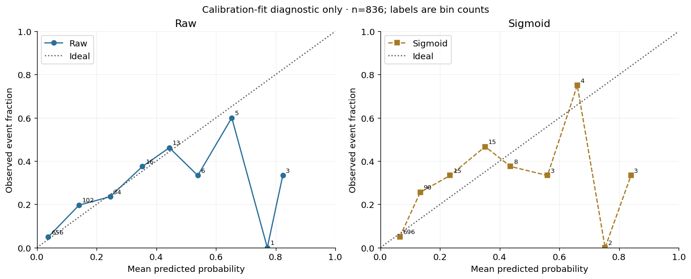

# Tamweel Lite — 90-Day Financing Default Risk Decision System

**Student:** Sarah Alanazi  
**Student code:** [Enter assigned student code before submission]  
**Course:** SDA-DSC-211 — Advanced Machine Learning Methods  
**Program:** SDAIA Academy

> Educational learner project. This repository is not an official SDAIA repository and is not intended for autonomous real-world lending decisions.

## Project Overview

Tamweel Lite is an end-to-end machine learning decision system that estimates whether a financing applicant may default within 90 days using only information available at application time.

The project connects predictive modeling with leakage-aware validation, cost-sensitive decision policy, explainability, calibration, operational capacity, and reproducible inference.

## Project Workflow

**Synthetic Data → Leakage Control → Time & Customer-Aware Validation → OOF Model Comparison → Cost & Capacity Policy → Explainability & Calibration → Final Model → Challenge Scoring**

The end-to-end workflow is organized into five connected project stages. The original course notebook filenames are retained for straightforward grading; student-labeled copies are also available in the same folder:

[Readiness Check](notebooks/00_readiness_check.ipynb) · [Final Submission Self-Check](notebooks/99_final_submission_check.ipynb)

1. [Baseline Modeling & Boosting](notebooks/01_baseline_boosting.ipynb)
2. [Honest Validation & Hyperparameter Tuning](notebooks/02_validation_tuning.ipynb)
3. [Cost-Sensitive Decision Policy](notebooks/03_cost_sensitive_decision.ipynb)
4. [Explainability & Calibration](notebooks/04_explain_calibrate.ipynb)
5. [Final Model, Inference & Delivery](notebooks/05_final_model.ipynb)

## Data

The synthetic course dataset contains **10,000 applications**, **22 application-time predictors**, and an observed default rate of approximately **8%**.

The prediction target is `default_within_90d`. Challenge labels remain unavailable and are not used for training, tuning, calibration, or threshold selection.

[Data Contract](data/data_contract.json) · [Training Data](data/tamweel_train.csv) · [Challenge Data](data/tamweel_challenge.csv)

## Honest Validation

Post-application leakage fields were removed before model development. Model comparison uses forward time-aware validation with customer separation, while threshold selection uses honest out-of-fold predictions. Preprocessing is learned from training rows only.

## Final Model Selection

**Logistic Regression** was retained as the final model because it achieved the highest mean out-of-fold Average Precision (**0.39166**) and none of the tested ensemble approaches passed the documented improvement gate.

| Final Evidence | Result |
|---|---:|
| Mean OOF Average Precision | **0.39166** |
| OOF Evaluation Rows | **2,155** |
| Raw OOF Threshold | **0.16892** |
| OOF Flagged Fraction | **11.37%** |
| Recall | **46.93%** |
| Precision | **34.29%** |
| Simulated Decision Loss | **1,111 units** |
| Review Capacity | **12%** |

## Decision Policy

The course decision policy uses simulated loss:

**10 × False Negatives + 1 × False Positives**

with review capacity limited to **12%**.

The threshold was selected from OOF development evidence rather than from final evaluation or challenge data.

For the final unlabeled challenge batch of **2,500 applications**, **330** requests exceeded the transported threshold. The frozen capacity policy retained the highest-risk **300 applications**, respecting the 12% capacity limit.

No challenge performance metric is reported because challenge labels are unavailable.

## Explainability and Calibration

Permutation importance and SHAP were used to inspect the **experimental LightGBM model**, not the final Logistic Regression model. `bureau_score` and `dti` were the strongest global SHAP drivers in the explainability analysis.

SHAP values represent model contributions in raw log-odds. They do not establish causal explanations, fairness, or legal compliance.

On **1,733 evaluation requests**, sigmoid calibration improved:

- Brier score: **0.1130 → 0.0671**
- Expected Calibration Error: **0.1469 → 0.0225**

ROC-AUC and Average Precision remained unchanged. These improvements apply to the **earlier LightGBM evaluation**, not the selected final Logistic Regression model. The final Logistic sigmoid calibration-fit diagnostics instead changed Brier **0.07647 → 0.07806** and ECE **0.02112 → 0.03487** on 836 reserved calibration-fit requests; this is **not an independent evaluation**.

Regional results are descriptive diagnostics only and are not a fairness certification.

### More Experimental Evidence

**Baseline boosting — ROC and precision–recall**

**Learning curves**

**Forward validation fold sizes**

**Optuna tuning search**

**Model calibration-fit diagnostics (final Logistic model; does not demonstrate improvement)**

Other saved plots: [model diversity](artifacts/day5_diversity.png), [regional capacity](evidence/day3/artifacts/day3_capacity_regions.png), [cost-region diagnostics](artifacts/day5_policy_regions.png), and [day 3 ROC / PR](evidence/day3/artifacts/day3_roc_pr.png).

## Required Reports

- [Decision Card](evidence/day3/reports/DECISION_CARD.md)
- [Interpretability Report](reports/INTERPRETABILITY_REPORT.md)
- [Ensemble Decision](reports/ENSEMBLE_DECISION.md)
- [Model Card](reports/MODEL_CARD.md)

## Environment and Reproducibility

The assessed workflow is designed to run on free Google Colab CPU.

Recorded final environment:

- Python **3.13.16**
- Random seed **211**
- `n_jobs=2`
- CPU execution

Exact package versions are recorded in [environment.json](artifacts/environment.json), with pinned dependencies in [requirements-colab.txt](requirements-colab.txt) and [constraints.txt](constraints.txt).

### Reproduction Steps

1. Open `00_readiness_check.ipynb`, then notebooks `01`–`05`, then `99_final_submission_check.ipynb` in Google Colab.
2. Use the included synthetic course data and pinned environment.
3. Start from a clean runtime.
4. Run each notebook using **Run all**.
5. Review the generated artifacts and reports.
6. Use [scripts/inference.py](scripts/inference.py) for the final inference interface.
7. Compare generated predictions with [submission.csv](submission/submission.csv) and the [submission manifest](submission/submission_manifest.json).

## Project Outputs

- [Final Metrics](artifacts/final_metrics.json)
- [Final Policy](artifacts/final_policy.json)
- [Final Model](artifacts/final_model/model.json)
- [Model Manifest](artifacts/final_model/model_manifest.json)
- [Submission](submission/submission.csv)
- [Submission Manifest](submission/submission_manifest.json)
- [Final Presentation](presentation/final_presentation.pdf)
- [Technical Project Check](artifacts/day5_project_check.json)

The previously recorded project check status is **READY FOR HUMAN REVIEW**. This status confirms technical readiness for review; it is not an automatic grade or submission receipt.

## Limitations and Responsible Use

This project uses synthetic educational data and simplified cost and capacity assumptions. Out-of-fold evidence from a limited number of forward periods does not guarantee future performance.

Model performance, calibration, capacity usage, score distributions, data drift, and regional diagnostics should be monitored over time.

The system is intended for education and analysis only and must not be used as an autonomous real-world lending decision system.

## Submission Notes

The renamed student-labeled notebook copies are provided alongside the **original numbered filenames required by the simplified course submission notice**. All five numbered notebooks include prior execution results. Run the newly added official readiness and final submission checks before submitting; they are provided as course templates and are **not claimed to have been executed** in this repository. Update the student code above with the actual assigned code. The presentation and submission are available in the linked project outputs.

## References and Disclosure

This project was completed as part of **SDA-DSC-211 — Advanced Machine Learning Methods** at **SDAIA Academy**.

[SDAIA Academy on GitHub](https://github.com/SDAIAAcademy)
